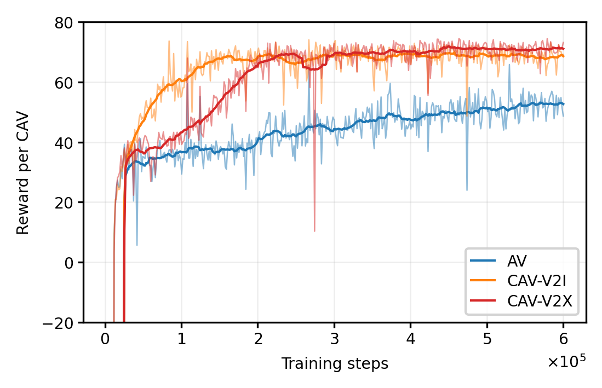
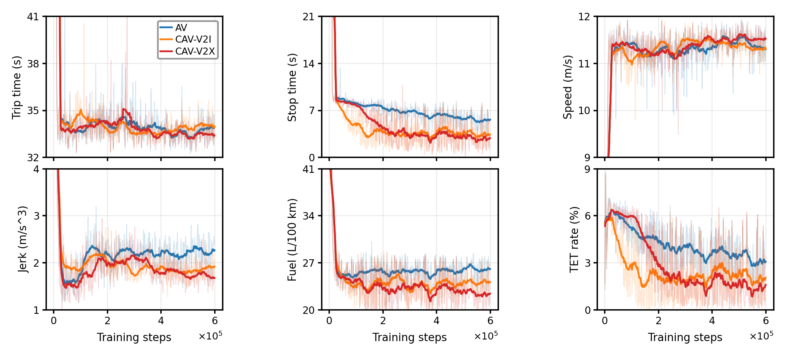
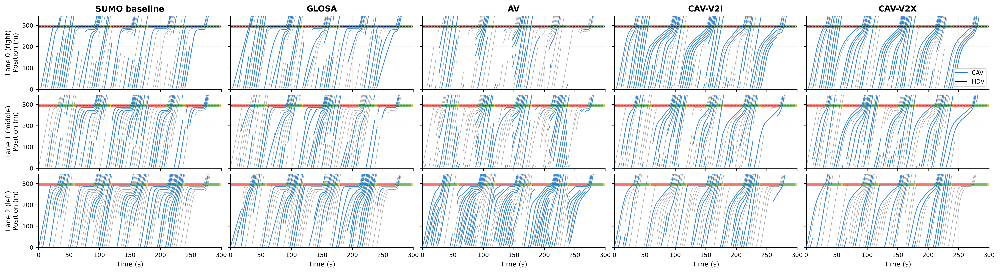
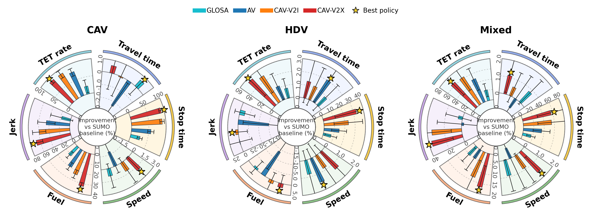
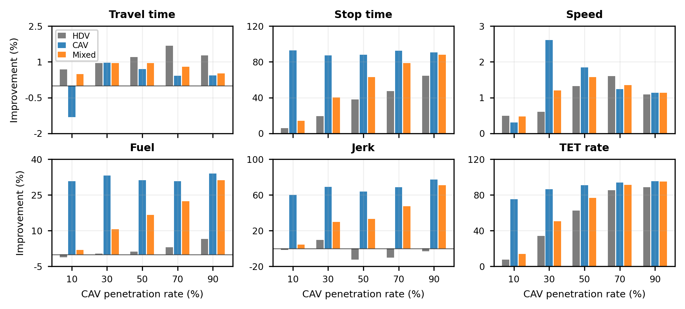
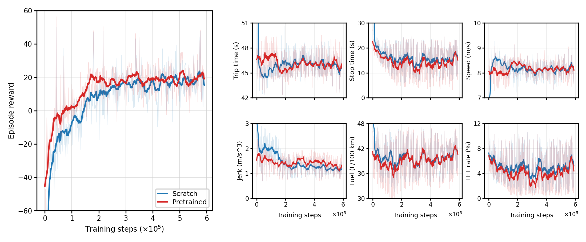
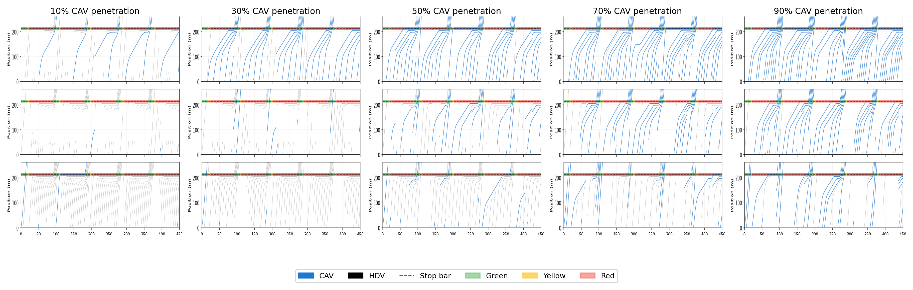

# Communication-Aware CAV Eco-Driving

This repository contains the reproducible code for SUMO-based connected and automated vehicle (CAV) eco-driving experiments in mixed traffic. It includes the reinforcement-learning agents, SUMO environments, training and evaluation entry points, and scenario configuration files.

The repository is intentionally code-focused. It does not include manuscript source files, raw training logs, raw evaluation outputs, or model checkpoints. A small set of representative result figures is included in `figures/` to make the experiment behavior easier to understand.

## Contents

```text
agents/                  RL agents: Hybrid SAC, PPO, DQN, TD-MPC2
common/                  Replay buffer, neural network layers, logging, metrics
envs/                    SUMO CAV intersection environments and wrappers
envs/sumo_files/         SUMO network, route, signal, and scenario files
trainer/                 Online/offline training loops
scripts/                 Convenience training and visualization scripts
tools/                   SUMO scenario construction utility
train.py                 Main training entry point
evaluate.py              RL policy evaluation entry point
evaluate_baseline.py     SUMO baseline evaluation
evaluate_glosa.py        SUMO GLOSA baseline evaluation
evaluate_comm_sensitivity.py  Communication-capacity evaluation
config.yaml              Hydra configuration
environment.yaml         Conda environment specification
figures/                 Representative training, evaluation, and trajectory results
```

## Representative Results

The main comparison considers three learned control settings:

- `AV`: local perception only, without V2I signal timing or V2V CAV context.
- `CAV-V2I`: local perception plus signal timing information.
- `CAV-V2X`: local perception, signal timing, and neighboring-CAV communication.

Across the evaluated scenarios, the communication-aware `CAV-V2X` policy gives the most balanced improvement among the learned policies. Averaged over the tested CAV penetration rates, its mixed-traffic performance improves relative to the SUMO baseline by approximately `0.7%` in travel-time saving, `56.8%` in stop-time saving, `1.1%` in speed improvement, `16.5%` in fuel saving, `37.5%` in jerk reduction, and `65.7%` in TET-rate reduction.

Training reward comparison:



Training performance metrics:



Evaluation trajectories at 50% CAV penetration:



Average savings by vehicle group:



Penetration sensitivity:



The real-parameter Sycamore/Central scenario is used to test adaptation from a pretrained model. Pretraining improves early convergence and stabilizes several performance metrics compared with training from scratch.



Pretrained-policy trajectories under different penetration rates:



## Setup

Create the Python environment:

```bash
conda env create -f environment.yaml
conda activate tdmpc2
```

Install Eclipse SUMO separately and set `SUMO_HOME`.

macOS:

```bash
brew install sumo
export SUMO_HOME=$(brew --prefix sumo)/share/sumo
```

Ubuntu/Debian:

```bash
sudo add-apt-repository ppa:sumo/stable
sudo apt-get update
sudo apt-get install sumo sumo-tools
export SUMO_HOME=/usr/share/sumo
```

Check the installation:

```bash
sumo --version
python -c "import traci; print('traci OK')"
```

## Quick Checks

Run a basic environment check:

```bash
python test_env.py
```

Run a short training smoke test:

```bash
python train.py steps=3000 eval_freq=3000 save_agent=false ts_plot_freq=0
```

## Training

Train the AV, V2I-only CAV, and V2X CAV settings:

```bash
# AV: no V2I/V2V communication
python train.py exp_name=av_control attention=false communication=false

# CAV-V2I: signal communication only
python train.py exp_name=cav_control_v2i attention=false communication=true

# CAV-V2X: signal and neighboring-CAV communication
python train.py exp_name=cav_control attention=true communication=true
```

The default outputs are written to:

```text
logs/sumo-intersection/<seed>/<exp_name>/
```

The convenience script runs the same core settings:

```bash
bash train.sh
```

## Evaluation

Evaluate SUMO and GLOSA baselines:

```bash
python evaluate_baseline.py exp_name=sumo_baseline rl_control=false sumo_default_cav_behavior=true
python evaluate_glosa.py exp_name=glosa_baseline glosa_enabled=true
```

Evaluate a trained RL checkpoint:

```bash
python evaluate.py \
  checkpoint=logs/sumo-intersection/1/cav_control/models/final.pt \
  exp_name=cav_control \
  attention=true \
  communication=true
```

Evaluation outputs are written to:

```text
eval_results/<exp_name>/
```

Compare evaluated policies against the SUMO baseline:

```bash
python compare_eval_results_to_baseline.py \
  --eval-root eval_results \
  --baseline sumo_baseline
```

## Real-Parameter Scenario

The repository also includes a Sycamore/Central PM-peak SUMO scenario with real-parameter demand and signal timing represented in the same three-lane through-intersection format.

Train or fine-tune on that scenario:

```bash
bash scripts/train_sycamore_pm2026.sh
```

Run paired scratch/pretrained experiments:

```bash
PRETRAINED_CHECKPOINT=logs/sumo-intersection/1/cav_control/models/final.pt \
bash scripts/train_sycamore_pm2026_scratch_vs_pretrained.sh
```

Visualize a trained policy in SUMO-GUI:

```bash
CHECKPOINT=logs/sumo-intersection/1/cav_control/models/final.pt \
bash scripts/visualize_sycamore_v2x.sh
```

## Configuration Notes

Important Hydra options:

```text
agent: sac | ppo | dqn | tdmpc2
attention: true | false
communication: true | false
comm_topology: full | front_only
context_size: number of neighboring CAV context tokens
communication_range_m: V2V communication range
lane_action_discrete: use categorical lane-change branch for Hybrid SAC
randomize_demand: randomize total flow and CAV penetration during training
```

Use command-line overrides to define fixed evaluation scenarios, for example:

```bash
python evaluate.py checkpoint=<path/to/final.pt> \
  total_flow_vph_min=2000 total_flow_vph_max=2000 \
  cav_penetration_min=0.5 cav_penetration_max=0.5
```

## Large Files

Model checkpoints, training logs, raw evaluation results, and temporary generated figures are intentionally ignored by git. The curated figures in `figures/` are tracked for documentation. If you want to distribute pretrained models, upload them as release assets or to an external archive and document the download path here.

## License

MIT License
